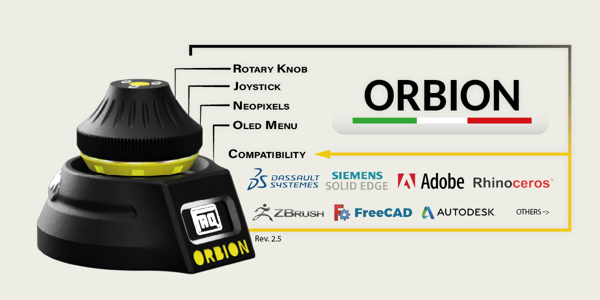
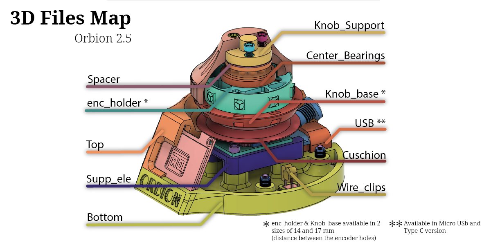
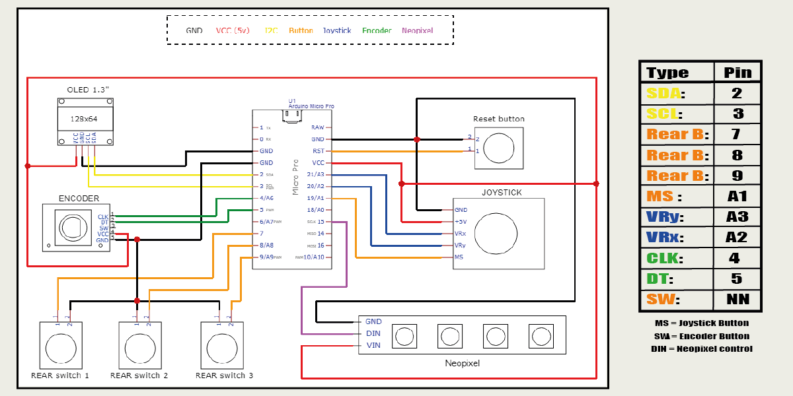
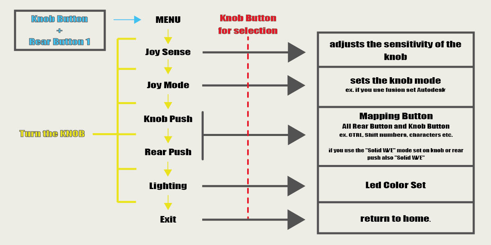

# Orbion The OpenSource 3D Space Mouse

### Next news
If you want to follow the live updates come to [Discord](https://discord.gg/tgut7grRTV)

### Version now available
- Hardware 2.5 (19/03/2022)
- Firmware 0.26.4 (19/03/2022)

All parts can be printed in the material of your choice (pay attention to the shrinkage factor of ABS and ASA), except for the "cuschio" and "wire_clips" parts which must be in TPU Shore 95A or 85A

Conf Example (Fusion 360)
- Set any key: SHIFT Key
- Set Joy Mode: Autodesk
- the other 3 buttons set them as you like

doing so by moving the knob you will get the orbit, while if you hold down the key you have mapped as "SHIFT key" and moving the knob at the same time you will get the PAN

# PAY ATTENTION

For problems caused by badly produced components and wrong heights due to the calibration of printers not created Tickets as they are unique problems and not attributable to the project.

To ensure greater precision and fluidity it is recommended to put a foam ring under the knob or Cushion_TPU and dielectric lubricant in the joystick!

If you notice that your joystick goes in different directions, you can change the direction, swapping the cables VRx and VRy or alternatively the variables horzPin and vertPin in the Settings.h

Before printing pay attention to the center distance of the encoder holes, 2 more diffuse sizes are available, 14mm and 17mm (file Enc_holder & Knob_axis)

I would like to point out that, if you use ABS it is good to know that some dimensions will not be correct if you do not take the usual precautions to the problem of shrinkage
In any case, make sure that your printer has the correct dimensional parameters

### You will find a PDF file that will guide you step by step for flashing the firmwar

# Social

- [Instagram](https://www.instagram.com/faq_t0tum/)
- [Discord](https://discord.gg/tgut7grRTV)
- [YouTube](https://www.youtube.com/channel/UCHJ_528ZI0BcSU-QA8kIJlg)
- [PrusaPrinter](https://www.prusaprinters.org/social/218145-faqtotum/about)

# Buy me a coffee

The ORBION project is OpenSource so if you have the pleasure of supporting my next works I will be grateful fot the coffee.  
[PayPal](https://www.paypal.me/MattiaRusso308?locale.x=it_IT)

# Compatibility

Cad & 3D sculptors supported (continuously updated):
- Fusion360
- Autoocad
- SolidWork
- Solid EDGE
- Onshape
- Ansa
- ZBrush
- Blender
- Adobe Suite
- Rhino
- FreeCAD

# BOM

Componets:
- M3x15 (3pcs)
- M3x6 or M3x8 (2pcs)
- M3x10 (4pcs)
[M3 Kit](https://s.click.aliexpress.com/e/_9R4lDe)
- [Insert 5x4 or 5x5 (Diameter x Height) M3 (10pcs)](https://s.click.aliexpress.com/e/_9yVx2u)
- [Oled 1.3" I2C](https://s.click.aliexpress.com/e/_AtYDV6)
- [Encoder (KY-040)](https://s.click.aliexpress.com/e/_AmjV9a)
- [Joystick (KY-023)](https://s.click.aliexpress.com/e/_A8hY9K) (important: the joystick shaft must be 4mm)
- [Arduino Pro Micro](https://s.click.aliexpress.com/e/_AYt9zi) ATTENTION: It is essential to use ARDUINO PRO MICRO with ATMEL32U4 processor
- [Push Button 8mm x3](https://s.click.aliexpress.com/e/_ADGxZS)
- [Cable 28awg](https://s.click.aliexpress.com/e/_A6xGln)
- [Neopixel Strip WS2812B](https://s.click.aliexpress.com/e/_APd9lZ) (Important: chose only the [1M 60 IP30] Versione
- [Microswitch (Reset)](https://s.click.aliexpress.com/e/_AZhwpN)
- [Axial Bearinger F8-22M](https://s.click.aliexpress.com/e/_ArBcYb)

# License 
### [Attribution-NonCommercial-NoDerivatives 4.0 International](https://creativecommons.org/licenses/by-nc-nd/4.0/)
 

You are free to:
- Share — copy and redistribute the material in any medium or format

Under the following terms:
- Attribution — You must give appropriate credit, provide a link to the license, and indicate if changes were made. You may do so in any reasonable manner, but not in any way that suggests the licensor endorses you or your use.
- NonCommercial — You may not use the material for commercial purposes.
- NoDerivatives — If you remix, transform, or build upon the material, you may not distribute the modified material.

### If you have any other MODs you want to share, 
### log into the [Discord](https://discord.gg/tgut7grRTV) channel and contact me to add into "Yours_Creations"

